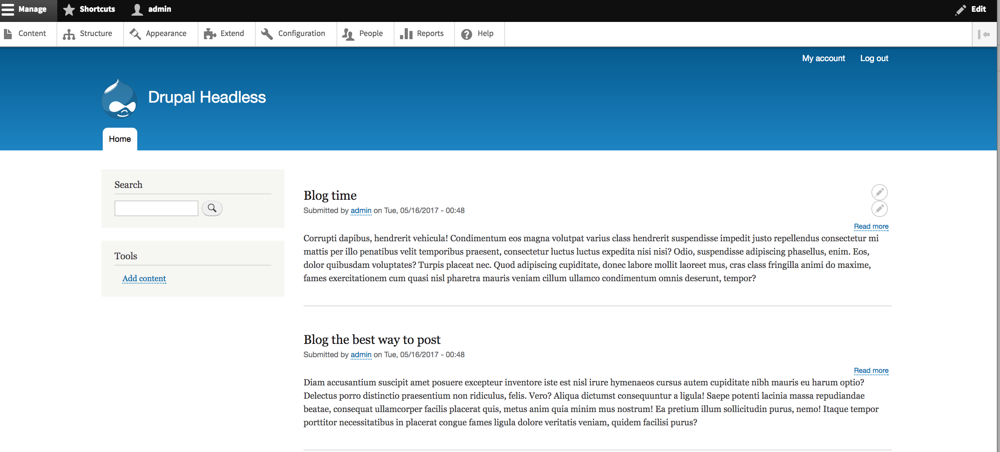

# How to create a headless Drupal site

In order to begining you can choose which option to follow:

# Option 1: 
1. Just Clone or download the repo called `durable-drupal-cms-client-01` (This contains a React App ready to use)
2. Skip and follow only the steps according `2. Create Drupal API` section
3. Using the repo you don't need to do `3. Integrate and display data` section
4. Go to `4. Drupal headless running` section.

> Or 

# Option 2:
Please follow the steps in order to create React app:

## 1. Create React App
First of all we are going to create a React App. It’s where the decoupled Drupal website originates. We will create a simple welcome page.

### Step 1.1
Create a simple basic folder structure with nothing extra, like the image below:


### Step 1.2
Use a cdn to add React to my index.html file:

> <script src="https://unpkg.com/react@15/dist/react.js"></script>
> <script src="https://unpkg.com/react-dom@15/dist/react-dom.js"></script>

### Step 1.3
Now add a <div> in `index.html`:

> <div id="container"></div>

### Step 1.4
Create a file `app.js` inside js folder and add “React is awesome!” example:

> ReactDOM.render(
> <h1>React is awesome!</h1>,
> document.getElementById('container')
> );

### Step 1.5
Also include babel to transform JSX syntax (from the previous step) into ECMAScript and include app.js file inside `index.html`:

> <script src="https://cdnjs.cloudflare.com/ajax/libs/babel-core/5.8.24/browser.min.js"></script>
> <script type="text/babel" src="js/app.js"></script>

**Important** Now, if you try to open index.html file in your Chrome browser (in Firefox it seems to work without advantage) you should have the **XMLHttpRequest error**. That means you need to use a HTTP server to make it work. The simplest way to start a new server is to use PHP's 5.4 and later built-in web server. You need to run this command inside of our React app directory using terminal:

`php -S localhost:8000`

Now if you go to  http://localhost:8000/ page you should see “React is awesome!”. It means that React works and we’re ready to go.


## 2. Create Drupal API

### Step 2.1
Create a new [Drupal](https://www.drupal.org/project/drupal) installation. For your convenience it's recommended to choose a standard Drupal installation over the minimal. 

### Step 2.2
Now add a new content type called "Blog". Let’s create with following fields:
* Title
* Body
* Image

### Step 2.3
Create a few nodes of "Blogs" content type. And you can see:



### Step 2.4
Go to `admin/modules` and enable all modules under the web services:


### Step 2.5
* Create a new view on `admin/structure/views/add` called `Blogs API` in order to create a required Web Service. 
* Add a filter for this view by content type "Blogs"
* Click the "Provide a REST export" checkbox and enter REST export path. For example: `api/blogs`. Please see the image below:


### Step 2.6
Now, if you go to api/blogs page you should see JSON data:


## 3. Integrate and display data

### Step 3.1
We can chose the axios client for the server request instead of jQuery because we need only AJAX features and we don't want to load the whole library (jQuery). So add this into index.html:

> <script src="https://unpkg.com/axios/dist/axios.min.js"></script>

### Step 3.2
1. Here is the full content of `app.js` file. We will display all the blogs nodes:
2. Render into DOM config. Please config `App source` with your `json data` path from your drupal site. According this example we called `api/blogs`. Like the image below:

[Json data config path](./img/json-data-config.png)

* Note: drupalheadlessexample replace by your drupal site name

```
class App extends React.Component {
 constructor() {
  super();
  // Set up initial state
  this.state = {
    data: []
  }
}

// after a component is rendered for the first time call the componentDidMount() method
componentDidMount() {
  var th = this;
  this.serverRequest = axios.get(this.props.source)
    .then(function(blog) {
      th.setState({
        data: blog.data
      });
    })
}

// call the componentWillUnMount() method before a component is unmounted from the DOM
componentWillUnmount() {
  this.serverRequest.abort();
}

render() {
  var titles = [];
  this.state.data.forEach(item => {
    titles.push(<h3 className="blogs">{item.title[0].value}</h3> );
  });
  return (
    <div className="container">
      <div className="row">
          <h1 className="title">Blogs:</h1>
          {titles}
      </div>
    </div>
  );
}
}

// render into DOM
ReactDOM.render(
<App source="http://localhost/drupalheadlessexample/api/blogs" />,
document.getElementById('container')
);

```

## 4. Drupal headless running 
### Step 1. Install chrome extension. 

In order to avoid cross-domain request like: “No 'Access-Control-Allow-Origin' header is present on the requested resource” install the following [chrome extension ](https://chrome.google.com/webstore/detail/allow-control-allow-origi/nlfbmbojpeacfghkpbjhddihlkkiljbi?hl=en-US)

### Step 2. Done!
* Go to `http://localhost:8000/` 
* And you should see something like this:


